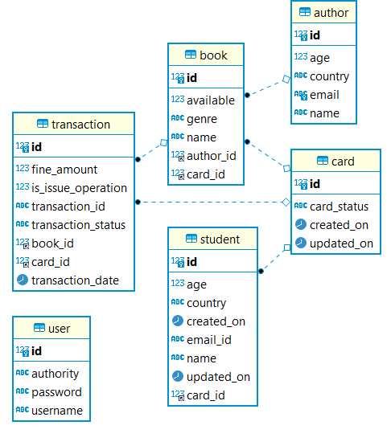
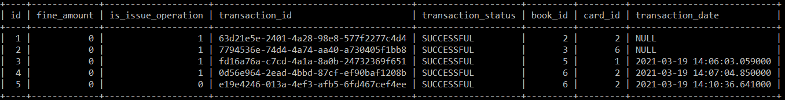

# Library-Management-System 
## Introduction 
A Library Management System designed to see the books available in a college library. It allows students to register as a user and issue/return books from the college library hassle free. The backend is designed as a **Monolithic Architecture** with various nuances as discussed below.
## Technologies and Dependencies Used
* [Maven](https://maven.apache.org/) used as a dependency management tool.
* [Spring Boot](https://spring.io/projects/spring-boot) used to build hassle free web applications and writing REST APIs.
* [Spring Security](https://spring.io/projects/spring-security) used for Authentication and Authorizations.
* [Spring data JPA (Hibernate)](https://hibernate.org/) Used to reduce the time of writing hardcoded sql queries and instead allows to write much more readable and scalable code 
* [MySQL](https://www.mysql.com/) used as a Java persistence store
* [Project Lombok](https://projectlombok.org/) Reduces the time  of writing java boiler plate code.

## Using Library Management System
CLI-->
```
git clone https://github.com/saikat021/Library-Management-System.git
cd Library-Management-System
mvn package 
java -jar target/Student-library-0.0.1-SNAPSHOT.jar
```
Intellij/Eclipse-->
1. Let maven resolve dependencies 
2. run SpringBootApplication

## Backend Design 
### Entities 
Actors/Entities are inspired by the real world entities that can use the applications  
1. **Student** having attributes:
* unique primary key student_id, country, emailId, name, age, card_id(foreign key) 
2. **Card** having attributes:
* unique primary key card_id, createdOn, updatedOn, status(ACTVATED/DEACTIVATED)
3. **Book** having attributes:
* Unique primary key book_id, isAvailable(True/False), genre, author_id(foreign key) 
4. **Author** having attributes:
* unique primary key author_id, country, name, emailId
5. **User** used mainly for authentication and authorization has attributes:
* unique primary key user_id, Authorization--> (STUDENT/ADMIN or BOTH), Username(emailId for student), Password. 

### Relationships Between Entities and ER diagram
An additional SQL table created to map the N:M mapping between the **Card** and the **Book** called **Transaction table**. The Transaction table has the following entities:
* unique primary key transaction_id which is not given back to the client
* Randomly Generated UUID given back to the calling client after the request is processed for future queries regarding the transactions
* Card_id Foreign  key
* Book_id Foreign key 
* isIssue Operations (true for issue operations and false for return operation)
* Transaction status (SUCCESSFUL/PENDING/FAILED)
* date
* fine amount (Applicable only while return operations and fine calculated based on a pre-defined Business logic written clearly in the Transaction Service class)


ER Diagram:


### Functionalities Exposed 
#### Student Controller class 
The REST APIs exposed are 
* CRUD APIs for the create, update, delete student information. The create student API **http://localhost:8080/student/createStudent** creates a student entity along with a card entry for that student and an user entity with Authorization as **STUDENT**.
* Another API exposed is of changing password. The default login details of any user are Username:->emailId provided at the time of createStudent API hit and Password:->pass123(Bcrypt Encoded). This API used to change the login details mainly the password. 

#### Book and Author Controller class 
The REST APIs exposed are normal CRUD operations on Book and Author entities.

#### Transaction Controller 
Two of the most important REST APIs exposed are:
##### Issue Book
**https://localhost:8080/issueBook?bookId=_&cardId=_** goes through the following operations before issueing a book:
Constraints : --> 
1. Check if card is Activated?
2. Check if the book is available? 
3. Check if the number of books issued with the requested card has gone past the maximum limit of number of books to be issued.
Operations :-->
1. Book status marked unavailable in the Book table.
2. Book is mapped to a card 
3. Transaction entry made in the transaction table and the Transaction unique UUID forwarded to the client in a Response Entity.


##### Return Book
**https://localhost:8080/returnBook?bookId=_&cardId=_** goes through the following operations before returning a book into the library.
Constraints: -->
1. Check if the book_id and card_id given is valid?
2. Check if card_id is Activated(As when the student account is deleted by the student the card remains there in a Deactivated state for further accountability).
Operations :-->
1. Make book available.
2. Make the card_id linked with the book null.
3. From the transaction Repository find the latest transaction entry in the table with the same card_id and book_id and is an issue opearation. Find the date from that and calculate the fine.
4. Make a new entry into the transaction table as an return operation and return the fine and unique UUID of the transaction entry to the calling client as a Response Entity.

Various transaction entries in the table:

 
### Security (Checkout Branch Security)
Spring Security is used for Authentication and Authorization. For every API call it is checked whether the calling entity has cookies that make it a valid entity in the system and the Username(emailId in the student table) is the same as the details of whichever entity is changed by hitting a CRUD API regarding that table.
* Few Examples:
Each example API preceeded by "http://localhost:8080"

* /student/all--> gives a list of all students in the system (ADMIN)
* /student/findById --> gives a student with particular id (ADMIN)
* /student/updateStudent--> update student details (STUDENT)[ADMIN should not be allowed to change the student details]
* /student/changePassword--> Strictly STUDENT access
* /transaction/all--> gives a list of all transactions in the system (ADMIN) 
* /transaction/issueBook--> issues a book(STUDENT)  
.....
## Author and Developed by
Saikat Chakraborty


